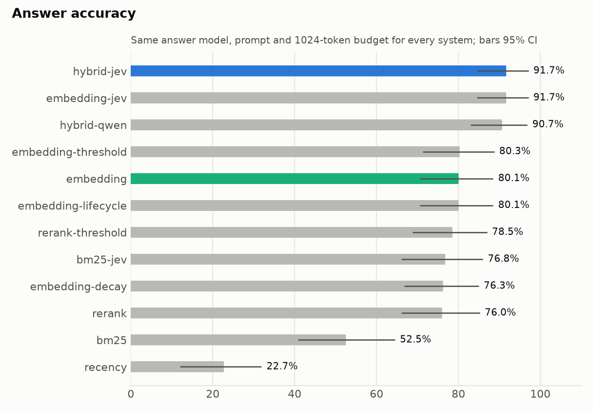
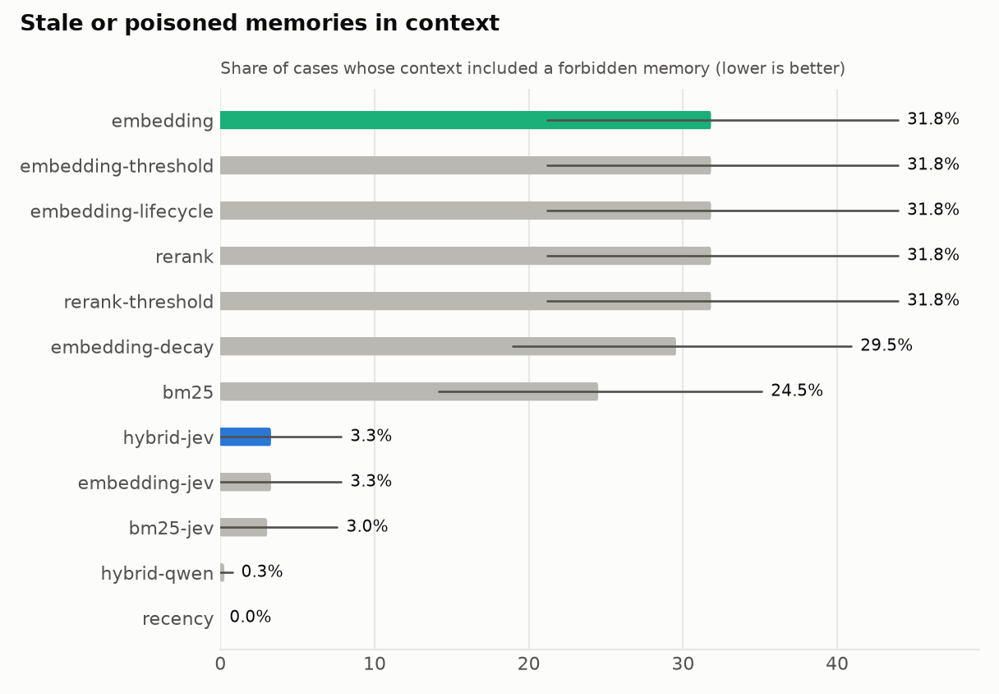
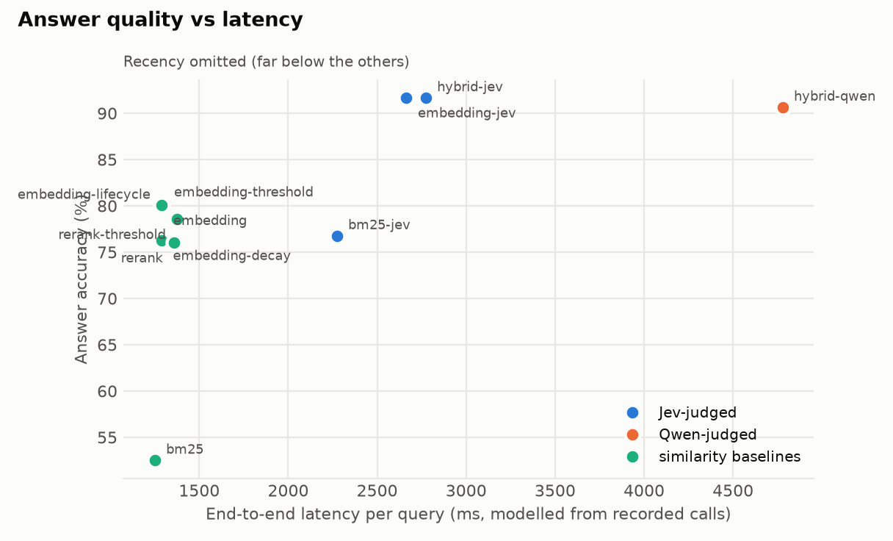
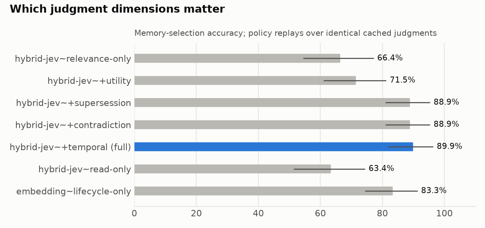
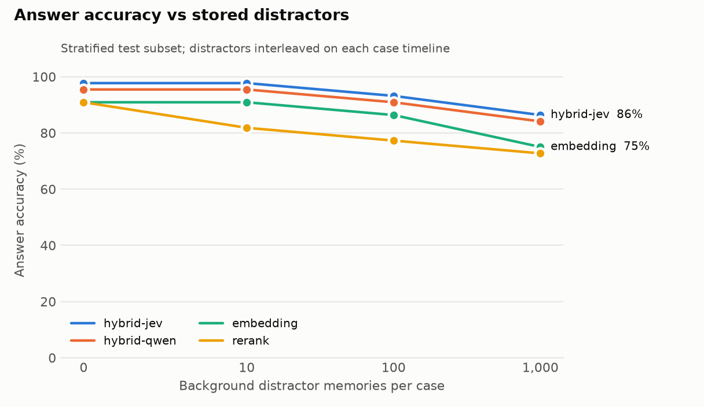
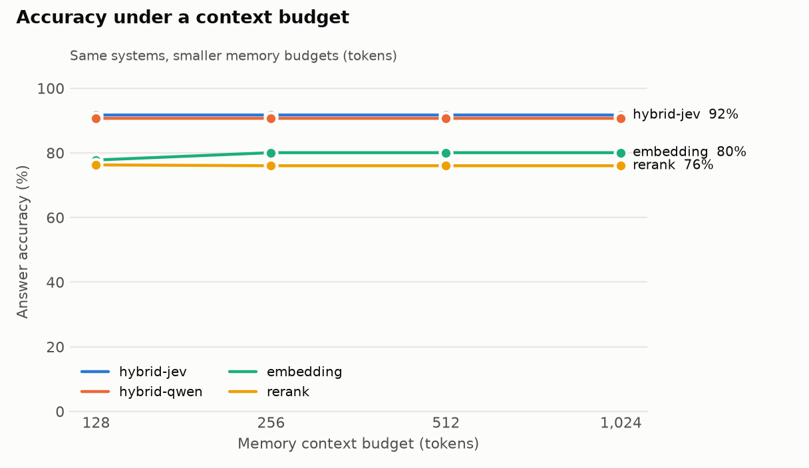
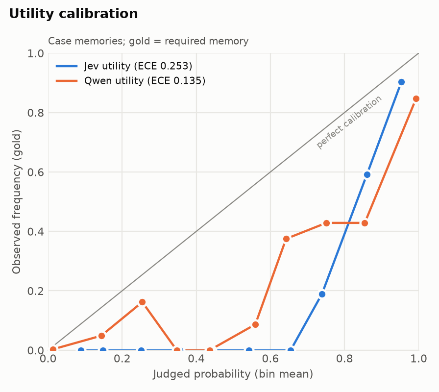

# JevMem M1: results summary

**What was tested.** Does a calibrated decision model (TypeSafe Jev) with a deterministic policy give better long-term agent memory than similarity-only retrieval?
- Write-time lifecycle: supersession, contradiction and duplicates are judged pairwise when a memory is written.
- Read-time judgment: relevance, utility and query intent.
- Every system uses the same answer model (Qwen `qwen3.8-27b`), the same answer prompt and the same 1024-token memory budget.

**Headline (pre-registered, held-out test split).**

| | Answer accuracy |
|---|---|
| hybrid-jev | **91.7%** |
| dense top-10 (strongest calib baseline) | 80.1% |
| **Difference** | **+11.6 pp** [95% CI +5.1, +19.2] |

66 template families, paired family bootstrap. By the pre-registered rule this counts as **better**.

**Two caveats**, both reported with the same weight as the headline:
1. **Qwen as the judge** in the identical architecture scores 90.7% (+1.0 pp [−3.5, +5.6]; no detectable difference). The gain comes mostly from the *architecture*: write-time lifecycle, judged selection and a deterministic policy. It is not a property of Jev's model.
2. **Qwen's probabilities were better calibrated than Jev's** on this data: utility ECE 0.135 vs 0.253, relation ECE 0.037 vs 0.087.

Jev's advantages over the Qwen judge are:
- judge latency: 1.5 s vs 3.5 s per query, with the caveat that Qwen was measured under shared load;
- running on a separate, cheap service: about $0.0006 per query at read time.

## Integrity controls

- **Freeze.** The question schema `q1.2`, prompts `qp1.0`/`a1.1`, policy `p1.2`, calibrated parameters and the pre-registration were frozen in commit `cd70129`. That commit came **before** any test case existed. The test families were added in `f7c79f3`.
- **Independent authoring.** The test families (66 families, 396 cases) were written by an independent agent. It was not allowed to read the questions Jev is asked, the prompts, the policy, the judges or any results.
- **Leakage probe.** A TF-IDF logistic regression trained on calib and scored on test reaches AUC **0.527**, which is chance. The test templates share no exploitable surface cues with calib.
- **Where tuning happened.** Question wording was iterated only on dev (2 iterations, applied to both judges). The Qwen judge got its own iteration: a prompt revision and a thinking-mode trial, neither of which helped.
  - Thresholds were calibrated only on calib, with the same objective (selection accuracy) for every system.
  - Calib was *also* used to fix benchmark bugs before test existed: plural alias matching, answers that could not be scored, one ambiguous family, the neighbour ranking, and the TTL table. Calib numbers are therefore not held-out estimates. The log is in `docs/methodology.md`.
- **Replay check.** Replaying dev entirely offline from the response cache reproduced every accuracy, selection and token metric exactly (60/60). Latency differed by ≤ 4 ms.
- **Judge failures:** none (0 cases excluded).

## All systems (test, 396 cases, 100 background distractors per case)

| System | Answer acc. | Selection acc. | Stale/poisoned memory in context | Ctx tokens | Judge ms | E2E ms |
|---|---|---|---|---|---|---|
| **hybrid-jev** | **91.7** [84.6, 97.0] | 89.9 | 3.3% | 60 | 1494 | 2773 |
| embedding-jev | 91.7 [84.6, 97.0] | 89.9 | 3.3% | 60 | 1385 | 2664 |
| hybrid-qwen | 90.7 [83.1, 96.7] | 90.4 | 0.3% | 44 | 3492* | 4778* |
| embedding-threshold | 80.3 [71.5, 88.6] | 60.6 | 31.8% | 262 | – | 1294 |
| **embedding (top-10)** | 80.1 [70.7, 88.4] | 60.6 | 31.8% | 235 | – | 1290 |
| embedding-lifecycle | 80.1 [70.7, 88.4] | 60.6 | 31.8% | 235 | – | 1290 |
| rerank-threshold | 78.5 [68.9, 86.9] | 61.4 | 31.8% | 1016 | – | 1376 |
| bm25-jev | 76.8 [66.2, 85.9] | 75.3 | 3.0% | 46 | 1021 | 2273 |
| embedding-decay | 76.3 [66.9, 84.8] | 57.6 | 29.5% | 192 | – | 1288 |
| rerank (top-10) | 76.0 [66.2, 85.1] | 58.3 | 31.8% | 234 | – | 1358 |
| bm25 (top-3) | 52.5 [40.9, 64.4] | 47.2 | 24.5% | 66 | – | 1249 |
| recency (top-6) | 22.7 [12.1, 31.8] | 13.6 | 0.0% | 151 | – | 1295 |

\* Qwen-judge latency was recorded while the same endpoint also served answer generation, so it is inflated.





### Where the difference comes from (exploratory; decomposed after seeing results)

| Category | hybrid-jev | embedding | Δ |
|---|---|---|---|
| adversarial (poisoned memories) | 100.0 | 44.4 | +55.6 |
| abstention | 83.3 | 58.3 | +25.0 |
| temporary state | 100.0 | 75.0 | +25.0 |
| similar but useless | 63.9 | 52.8 | +11.1 |
| contradiction | 100.0 | 91.7 | +8.3 |
| lexically distant | 66.7 | 61.1 | +5.6 |
| historical | 100.0 | 97.2 | +2.8 |
| supersession / implicit update / plain recall | 100.0 | 100.0 | 0 |
| coexistence | 94.4 | 100.0 | −5.6 |

- **Excluding adversarial:** +7.2 pp [+1.7, +13.6]. **Excluding adversarial and abstention:** +5.2 pp [+0.3, +11.1].
- **Where cases disagree:** 49 went hybrid-jev's way and 3 went the other way.
- **Updates tie:** on explicit and implicit supersession both systems score 100%. When dated old and new memories are both in context, the answer model resolves updates itself. The judged approach helps when dates do not settle the question: expired temporary situations, injected instructions, and near-miss memories that tempt the model into answering instead of abstaining.

### Ablations: which dimensions matter (policy replays over identical cached judgments)

| Variant | Selection acc. | Answer acc. | Stale in ctx |
|---|---|---|---|
| relevance only | 66.4 | 89.4 | 27.3% |
| + utility | 71.5 | 90.9 | 22.2% |
| + supersession (and intent) | 88.9 | 90.9 | 4.8% |
| + contradiction | 88.9 | 90.9 | 4.8% |
| + temporal validity (full) | 89.9 | 91.7 | 3.3% |
| read-only (no write-time lifecycle) | 63.4 | 84.8 | 30.3% |
| lifecycle only (dense top-10, non-current withheld, no read-time judge) | 83.3 | 83.3 | 1.8% |

- **Selection vs answers.** Selection quality depends mostly on supersession, which removes stale memories. Answer accuracy moves much less, because the answer model tolerates stale context when the dates are shown.
- **The two halves need each other.** The write-time lifecycle and the read-time judge are complementary: removing either costs 7–8 answer points.
- **Caveat on these ablations.** The judge's input includes a Python-computed `memory_status` label, so the ablations remove the *policy's* use of each dimension while the judge's inputs stay the same.



### Distractor saturation and pool size (stratified test subset: 44 cases, 1 per family)

| Distractors per case | 0 | 10 | 100 | 1000 |
|---|---|---|---|---|
| hybrid-jev answer acc. | 97.7 | 97.7 | 93.2 | 86.4 |
| hybrid-qwen answer acc. | 95.5 | 95.5 | 90.9 | 84.1 |
| embedding answer acc. | 90.9 | 90.9 | 86.4 | 75.0 |
| rerank answer acc. | 90.9 | 81.8 | 77.3 | 72.7 |

- **At 1,000 distractors the limit is first-stage retrieval.** Only 87.5% of required memories reach Jev.
- **Pool-size sweep** (hybrid-jev at 1,000 distractors):

  | Pool per retriever | Answer acc. | Judge latency |
  |---|---|---|
  | 5 | 84.1 | 1.45 s |
  | 10 | 84.1 | 1.80 s |
  | 20 | 86.4 | 2.33 s |
  | 50 | 88.6 | 3.59 s |

  A bigger pool trades judge latency for recall.



### Context budget

Accuracy is essentially flat across budgets of 128, 256, 512 and 1024 tokens:
- Judged systems inject about 44–60 tokens, so the budget never binds.
- Dense top-10 drops from 80.1 to 77.8 at 128 tokens.
- Synthetic memories are short, so this benchmark does not stress the budget. That is a limitation.



### Write-time lifecycle quality (gold pairs, test)

| Judge | Supersession P / R | Contradiction P / R | False supersession | Neighbour recall |
|---|---|---|---|---|
| Jev | 1.00 / 0.91 | 1.00 / 0.97 | 0 / 36 | 185 / 186 |
| Qwen | 1.00 / 0.99 | 1.00 / 0.86 | 0 / 36 | 185 / 186 |

### Calibration (judge probabilities vs gold)

| Probabilities | ECE | Brier |
|---|---|---|
| Jev utility (case memories) | 0.253 | 0.164 |
| Qwen utility (case memories, from token logprobs) | 0.135 | 0.115 |
| Jev relation (top choice) | 0.087 | 0.073 |
| Qwen relation (top choice) | 0.037 | 0.015 |

- **Both are overconfident** against the gold proxy ("required"), and "useful" is broader than "required".
- **Jev behaves like a sharp ranker:** almost no required memories below 0.65. It is not a calibrated probability on this proxy.



### Nondeterminism (Jev, 50 test cases, re-judged without the cache)

- **Score changes:** mean |Δ| of 0.003 on relevance and 0.005 on utility; the largest single change was 0.12.
- **Intent** came out differently in 2% of cases.
- **Policy decisions** flipped for 0.64% of candidates.
- **The selected context** changed in 6% of cases.

The pinned snapshot `typesafe/jev-1.13-20260917` plus the response cache is what makes results reproducible.

### Cost

- **Jev at read time:** about 26 calls and about 14k input tokens per query, roughly **$0.0006 per query** as reported by OpenRouter.
- **Write-time cost** is separate: one profile call per memory plus one call per compared neighbour, which is at most 5 active and 2 superseded neighbours.
- **Total Jev spend for all M1 runs so far:** $2.55 over about 101k calls.

### LongMemEval_S (partial: 82 of 148 pre-registered instances)

**Status: partial, stopped to limit spend.**
- The run stopped when the OpenRouter key reached its monthly spend limit, and it was not resumed.
- The 82 instances reported are the **first 82 in file order**: exactly those whose Jev and Qwen-judge calls had been cached by then. The key set the cutoff, not the results.
- They cover the whole **single-session-user control** (70 of 70, including 6 abstention questions) and **12 of 78 knowledge-update** instances.
- Answers were graded with LongMemEval's official prompts on Qwen, so these numbers are not comparable to published GPT-4o-judged results.

| System | Answer acc. [95% CI] | single-session-user | abstention | knowledge-update | Context tokens |
|---|---|---|---|---|---|
| **hybrid-jev** | **93.9%** [87.8, 98.8] | 60/64 | 6/6 | 11/12 | 149 |
| hybrid-qwen | 89.0% [81.7, 95.1] | 56/64 | 6/6 | 11/12 | 114 |
| dense top-10 | 91.5% [84.1, 97.6] | 60/64 | 4/6 | 11/12 | 344 |
| cross-encoder rerank top-10 | 91.5% [85.4, 97.6] | 61/64 | 3/6 | 11/12 | 420 |
| dense + heuristic lifecycle | 89.0% [81.7, 95.1] | 59/64 | 4/6 | 10/12 | 343 |
| BM25 top-3 | 84.1% [76.8, 91.5] | 56/64 | 3/6 | 10/12 | 335 |

- **Primary comparison:** hybrid-jev minus dense top-10 is **+2.4 pp [−2.4, +7.3]**. That is **no detectable difference**; each instance is its own bootstrap cluster.
- **Same accuracy, less than half the context:** 149 vs 344 tokens. Two instances separate the systems, and both are abstention questions. On the plain single-fact control, real conversations are easy for dense retrieval, and the systems tie at 60/64.
- **Updates on real data are still untested.** With 12 knowledge-update instances (11/12 vs 11/12), nothing can be concluded. That subset was the pre-registered test of the main idea on real data, and 66 of its instances were not run.
- **"Forbidden in ctx" is high by design here.** In annotate mode a superseded turn stays in context with a "possibly updated" note, rather than being withheld. Answer accuracy is the metric that matters.

Full report: [`lme-partial-82/report.md`](lme-partial-82/report.md).

## Limitations

- **Synthetic data.** The benchmark is template-generated. It is natural-sounding and independently authored, but it is not real conversation logs. The LongMemEval track addresses this partially.
- **One answer model** (Qwen 27B), a strong one. With a weaker answer model, dense retrieval's stale context may hurt more; with a stronger one, less.
- **Embedding size.** The dense baseline uses Qwen3-Embedding-0.6B. A larger embedder could narrow the first-stage gap at 1,000 distractors.
- **Calib was used for bug fixes** as well as calibration, so only test numbers are held-out.
- **Latency** is modelled from recorded per-call latencies under benchmark load. The Qwen judge and the answer model shared one endpoint.
- **Dimension ablations** change only the policy; the judge input includes `memory_status`.
- **The budget sweep is uninformative** here, because memories are short.

## Reproduce

```bash
uv sync --extra embeddings --extra bench
uv run jevmem benchmark run --run-id test-main --split test --n-background 100 \
  --params benchmarks/params/calibrated-v1.json --budgets 128,256,512 --ablations
uv run jevmem benchmark report --run-id test-main
```

With the published response cache, add `--replay` to reproduce every judgment and answer offline.
