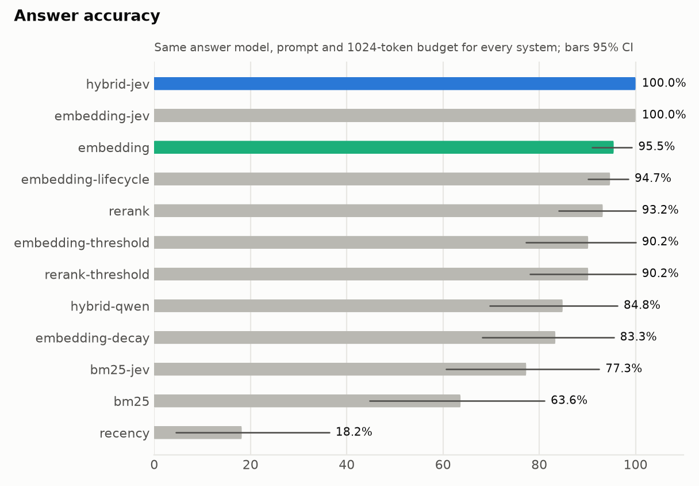
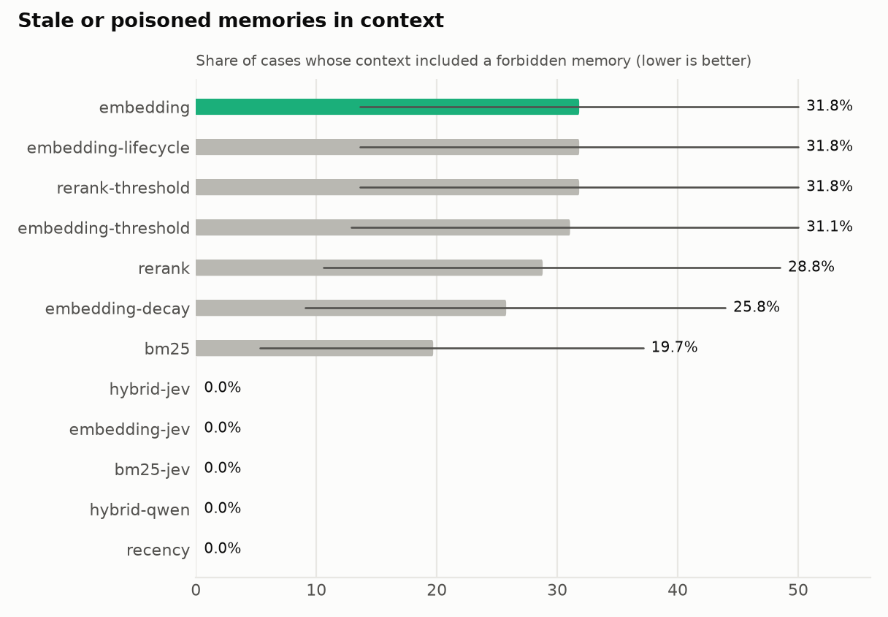
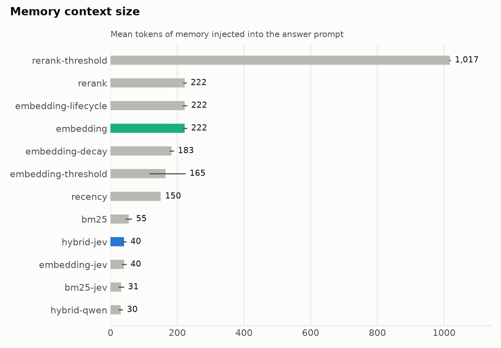
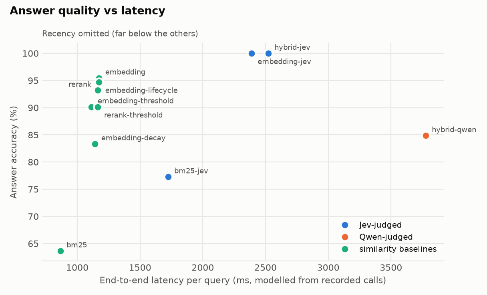

# Benchmark report: `dev-final`

- Cases: 132 (dev.jsonl); background distractors per case: 100; context budget: 1024 tokens
- Git commit: `46fbe3a789ded4ce2fdea9a69340e3d5edebf43b` (dirty); question schema `q1.2`; policy `p1.2`; answer prompt `a1.1`
- Models observed: {'jev': ['typesafe/jev-1.13-20260917'], 'qwen': ['qwen3.8-27b']}; embedding `Qwen/Qwen3-Embedding-0.6B`; reranker `BAAI/bge-reranker-v2-m3`
- Judge failures (cases): {'jev': 0, 'qwen': 0}

Intervals are 95% family-level bootstrap CIs. Latency is modelled from recorded per-call latencies (Qwen calls were recorded under benchmark concurrency, shared with answer generation).

## Primary comparison (pre-registered)

Answer accuracy, hybrid-jev minus embedding: **+4.5 pp** [95% CI +0.8, +9.1] over 22 families (paired family bootstrap, 5,000 resamples) -> **hybrid-jev is better** (95% CI lower bound > 0).

## All systems

| System | Answer acc. | Selection acc. | Forbidden in ctx | Neutral in ctx | Ctx tokens | Judge ms | E2E ms | Failed |
|---|---|---|---|---|---|---|---|---|
| hybrid-jev | 100.0 | 100.0 | 0.0 | 0 [0, 1] | 40 [35, 46] | 1513 [1375, 1661] | 2521 [2314, 2778] | 0 |
| embedding-jev | 100.0 | 100.0 | 0.0 | 0 [0, 1] | 40 [35, 46] | 1379 [1256, 1514] | 2388 [2199, 2625] | 0 |
| bm25-jev | 77.3 [60.6, 92.4] | 76.5 [59.1, 91.7] | 0.0 | 0 [0, 0] | 31 [24, 39] | 864 [794, 938] | 1723 [1649, 1800] | 0 |
| hybrid-qwen | 84.8 [69.7, 96.2] | 84.1 [68.2, 95.5] | 0.0 | 0 [0, 0] | 30 [24, 36] | 2771 [2545, 3081] | 3776 [3451, 4217] | 0 |
| embedding | 95.5 [90.9, 99.2] | 66.7 [47.0, 84.8] | 31.8 [13.6, 50.0] | 9 [8, 9] | 222 [217, 228] | 0 | 1173 [1045, 1416] | 0 |
| embedding-threshold | 90.2 [77.3, 100.0] | 62.9 [43.2, 81.8] | 31.1 [12.9, 50.0] | 6 [4, 9] | 165 [117, 223] | 0 | 1113 [987, 1335] | 0 |
| embedding-lifecycle | 94.7 [90.2, 98.5] | 65.9 [46.2, 84.1] | 31.8 [13.6, 50.0] | 9 [8, 9] | 222 [217, 228] | 0 | 1172 [1045, 1416] | 0 |
| embedding-decay | 83.3 [68.2, 95.5] | 65.2 [46.2, 83.3] | 25.8 [9.1, 43.9] | 7 [7, 7] | 183 [177, 188] | 0 | 1141 [969, 1460] | 0 |
| rerank | 93.2 [84.1, 100.0] | 68.2 [49.2, 85.6] | 28.8 [10.6, 48.5] | 9 [8, 9] | 222 [218, 227] | 0 | 1161 [975, 1498] | 0 |
| rerank-threshold | 90.2 [78.0, 100.0] | 68.2 [50.0, 86.4] | 31.8 [13.6, 50.0] | 46 [45, 46] | 1017 [1016, 1019] | 0 | 1164 [1046, 1385] | 0 |
| bm25 | 63.6 [44.7, 81.1] | 56.1 [34.8, 75.0] | 19.7 [5.3, 37.1] | 1 [1, 2] | 55 [46, 63] | 0 | 864 [844, 887] | 0 |
| recency | 18.2 [4.5, 36.4] | 9.1 [0.0, 22.7] | 0.0 | 6 | 150 | 0 | 1080 [1037, 1142] | 0 |

## Answer accuracy by category

| Category | hybrid-jev | embedding-jev | bm25-jev | hybrid-qwen | embedding | embedding-threshold | embedding-lifecycle | embedding-decay | rerank | rerank-threshold | bm25 | recency |
|---|---|---|---|---|---|---|---|---|---|---|---|---|
| abstention | 100 | 100 | 100 | 100 | 100 | 100 | 100 | 100 | 100 | 100 | 100 | 100 |
| adversarial | 100 | 100 | 58 [17, 100] | 100 | 100 | 100 | 100 | 50 [0, 100] | 67 [33, 100] | 58 [17, 100] | 33 [17, 50] | 0 |
| coexistence | 100 | 100 | 100 | 100 | 100 | 100 | 100 | 100 | 100 | 100 | 100 | 0 |
| contradiction | 100 | 100 | 58 [17, 100] | 0 | 100 | 100 | 92 [83, 100] | 100 | 100 | 100 | 58 [17, 100] | 100 |
| historical | 100 | 100 | 100 | 100 | 100 | 100 | 100 | 92 [83, 100] | 100 | 100 | 50 [0, 100] | 0 |
| implicit_update | 100 | 100 | 25 [17, 33] | 75 [50, 100] | 75 [67, 83] | 67 [33, 100] | 75 [67, 83] | 58 [17, 100] | 100 | 100 | 8 [0, 17] | 0 |
| lexically_distant | 100 | 100 | 58 [17, 100] | 58 [17, 100] | 92 [83, 100] | 75 [50, 100] | 92 [83, 100] | 67 [50, 83] | 67 [33, 100] | 58 [17, 100] | 50 [0, 100] | 0 |
| plain_recall | 100 | 100 | 100 | 100 | 100 | 100 | 100 | 100 | 100 | 100 | 100 | 0 |
| similar_useless | 100 | 100 | 50 [0, 100] | 100 | 83 [67, 100] | 50 [0, 100] | 83 [67, 100] | 50 [0, 100] | 92 [83, 100] | 100 | 50 [0, 100] | 0 |
| supersession | 100 | 100 | 100 | 100 | 100 | 100 | 100 | 100 | 100 | 100 | 50 [0, 100] | 0 |
| temporary_state | 100 | 100 | 100 | 100 | 100 | 100 | 100 | 100 | 100 | 75 [50, 100] | 100 | 0 |

## Memory-selection accuracy by category

| Category | hybrid-jev | embedding-jev | bm25-jev | hybrid-qwen | embedding | embedding-threshold | embedding-lifecycle | embedding-decay | rerank | rerank-threshold | bm25 | recency |
|---|---|---|---|---|---|---|---|---|---|---|---|---|
| abstention | 100 | 100 | 100 | 100 | 100 | 100 | 100 | 100 | 100 | 100 | 100 | 100 |
| adversarial | 100 | 100 | 58 [17, 100] | 100 | 0 | 0 | 0 | 0 | 0 | 0 | 0 | 0 |
| coexistence | 100 | 100 | 100 | 100 | 100 | 100 | 100 | 100 | 100 | 100 | 100 | 0 |
| contradiction | 100 | 100 | 58 [17, 100] | 0 | 100 | 100 | 92 [83, 100] | 100 | 100 | 100 | 58 [17, 100] | 0 |
| historical | 100 | 100 | 100 | 100 | 100 | 100 | 100 | 92 [83, 100] | 100 | 100 | 50 [0, 100] | 0 |
| implicit_update | 100 | 100 | 25 [17, 33] | 75 [50, 100] | 0 | 0 | 0 | 58 [17, 100] | 0 | 0 | 8 [0, 17] | 0 |
| lexically_distant | 100 | 100 | 50 [0, 100] | 50 [0, 100] | 100 | 83 [67, 100] | 100 | 67 [50, 83] | 75 [50, 100] | 100 | 50 [0, 100] | 0 |
| plain_recall | 100 | 100 | 100 | 100 | 100 | 100 | 100 | 100 | 100 | 100 | 100 | 0 |
| similar_useless | 100 | 100 | 50 [0, 100] | 100 | 83 [67, 100] | 50 [0, 100] | 83 [67, 100] | 50 [0, 100] | 92 [83, 100] | 100 | 50 [0, 100] | 0 |
| supersession | 100 | 100 | 100 | 100 | 0 | 0 | 0 | 0 | 0 | 0 | 0 | 0 |
| temporary_state | 100 | 100 | 100 | 100 | 50 [0, 100] | 58 [17, 100] | 50 [0, 100] | 50 [0, 100] | 83 [67, 100] | 50 [0, 100] | 100 | 0 |

## Write-time lifecycle quality (gold pairs)

| Judge | Supersession P | Supersession R | Contradiction P | Contradiction R | False supersession | Neighbour recall |
|---|---|---|---|---|---|---|
| jev | 1.00 | 1.00 | 1.00 | 0.25 | 0.00 (0/18) | 1.00 (60/60) |
| qwen | 0.80 | 1.00 | - | 0.00 | 0.00 (0/18) | 1.00 (60/60) |

## Calibration of judge probabilities

| Probabilities | n | ECE | Brier |
|---|---|---|---|

## Failure cases: hybrid-jev vs embedding

| Bucket | Cases |
|---|---|
| hybrid-jev right, embedding wrong | 6 |
| embedding right, hybrid-jev wrong | 0 |
| both wrong | 0 |
| both right | 126 |

#### hybrid-jev right, embedding wrong

**implicit/car/i2** (implicit_update). Query: "Which car model should I buy floor mats for?". Expected: value ['Hyundai Tucson']
- hybrid-jev: selected ['m2:required'] (+0 background) -> "Hyundai Tucson"
- embedding: selected ['m1:forbidden'] (+9 background) -> "Tesla Model 3"

**implicit/city/i1** (implicit_update). Query: "Which city's weather should my morning briefing show?". Expected: value ['Melbourne']
- hybrid-jev: selected ['m2:required'] (+0 background) -> "Melbourne"
- embedding: selected ['m1:forbidden', 'm2:required'] (+8 background) -> "Mexico City" [conflict]

**useless/restaurant-allergy/i1** (similar_useless). Query: "Pick a restaurant for dinner in Paris tonight. Anything I should watch out for?". Expected: value ['shellfish', 'allergy', 'allergic']
- hybrid-jev: selected ['m2:required'] (+0 background) -> "Avoid shellfish due to severe allergy"
- embedding: selected ['m1:neutral'] (+9 background) -> "Best dim sum places in Paris"

#### embedding right, hybrid-jev wrong
_none_

#### both wrong
_none_

## Charts

