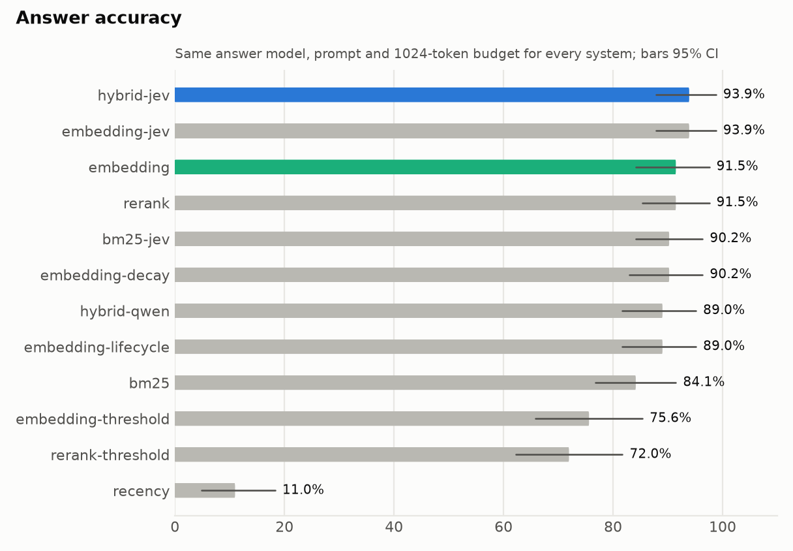
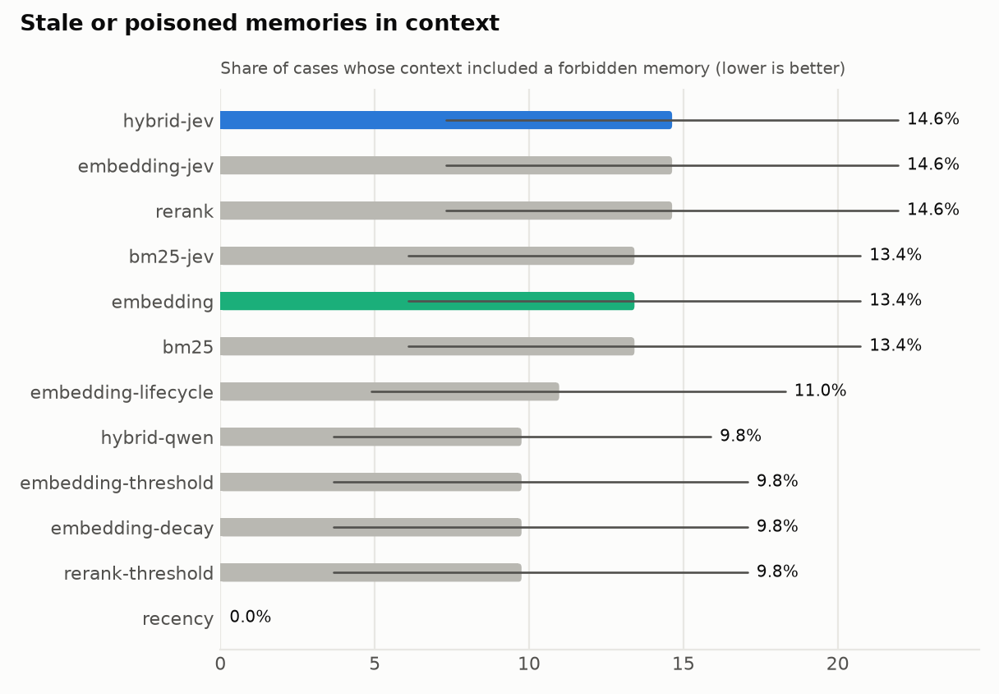
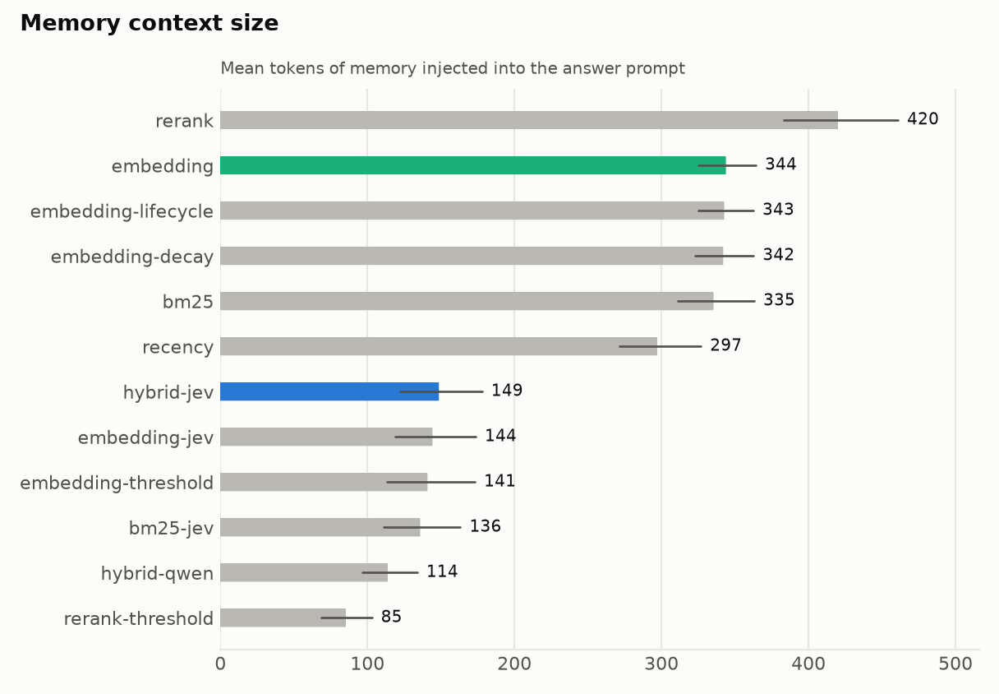
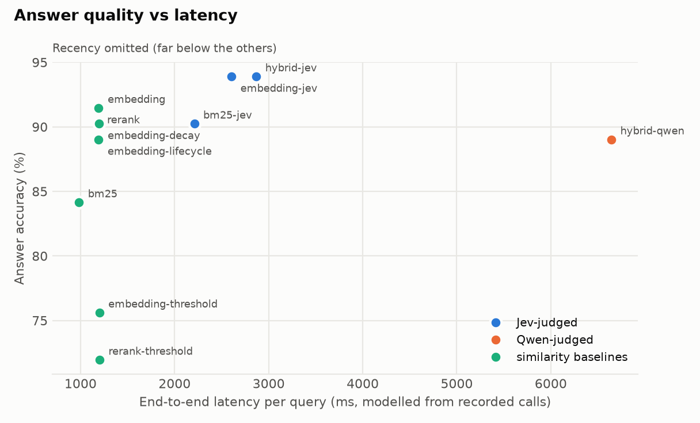
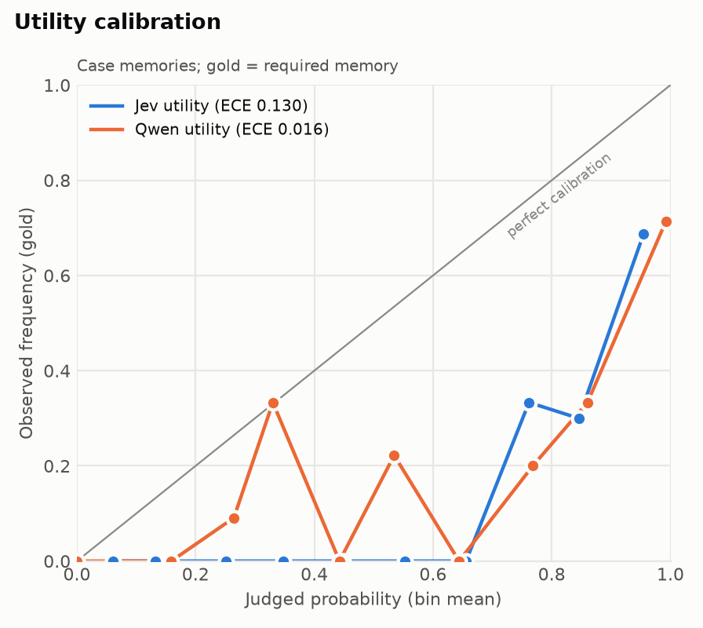

# Benchmark report: `lme-partial-82`

- Cases: 82 (cases-preregistered-first82.jsonl); background distractors per case: 0; context budget: 1024 tokens
- Git commit: `ffdd05fd5d9d4c788d6c09c27644cd1311db2bf2` (dirty); question schema `q1.2`; policy `p1.2`; answer prompt `a1.1`
- Models observed: {'jev': ['typesafe/jev-1.13-20260917'], 'qwen': ['qwen3.8-27b']}; embedding `Qwen/Qwen3-Embedding-0.6B`; reranker `BAAI/bge-reranker-v2-m3`
- Judge failures (cases): {'jev': 0, 'qwen': 0}

Intervals are 95% family-level bootstrap CIs. Latency is modelled from recorded per-call latencies (Qwen calls were recorded under benchmark concurrency, shared with answer generation).

## Primary comparison (pre-registered)

Answer accuracy, hybrid-jev minus embedding: **+2.4 pp** [95% CI -2.4, +7.3] over 82 families (paired family bootstrap, 5,000 resamples) -> **no detectable difference** (95% CI contains 0).

## All systems

| System | Answer acc. | Selection acc. | Forbidden in ctx | Neutral in ctx | Ctx tokens | Judge ms | E2E ms | Failed |
|---|---|---|---|---|---|---|---|---|
| hybrid-jev | 93.9 [87.8, 98.8] | 85.4 [78.0, 92.7] | 14.6 [7.3, 22.0] | 1 [0, 1] | 149 [122, 178] | 1676 [1545, 1807] | 2869 [2606, 3257] | 0 |
| embedding-jev | 93.9 [87.8, 98.8] | 85.4 [78.0, 92.7] | 14.6 [7.3, 22.0] | 1 [0, 1] | 144 [119, 174] | 1411 [1308, 1517] | 2605 [2362, 2999] | 0 |
| bm25-jev | 90.2 [84.1, 96.3] | 84.1 [75.6, 91.5] | 13.4 [6.1, 20.7] | 0 [0, 1] | 136 [111, 163] | 1236 [1141, 1336] | 2209 [2115, 2314] | 0 |
| hybrid-qwen | 89.0 [81.7, 95.1] | 85.4 [76.8, 92.7] | 9.8 [3.7, 15.9] | 0 [0, 1] | 114 [97, 134] | 5431 [4352, 6570] | 6644 [5575, 7771] | 0 |
| embedding | 91.5 [84.1, 97.6] | 84.1 [75.6, 91.5] | 13.4 [6.1, 20.7] | 4 [4, 4] | 344 [325, 364] | 0 | 1194 [1004, 1558] | 0 |
| embedding-threshold | 75.6 [65.9, 85.4] | 67.1 [57.3, 76.8] | 9.8 [3.7, 17.1] | 1 [1, 1] | 141 [113, 173] | 0 | 1200 [1011, 1565] | 0 |
| embedding-lifecycle | 89.0 [81.7, 95.1] | 82.9 [74.4, 90.2] | 11.0 [4.9, 18.3] | 4 [4, 4] | 343 [325, 362] | 0 | 1192 [1003, 1558] | 0 |
| embedding-decay | 90.2 [82.9, 96.3] | 87.8 [80.5, 93.9] | 9.8 [3.7, 17.1] | 4 [4, 4] | 342 [323, 363] | 0 | 1194 [1004, 1559] | 0 |
| rerank | 91.5 [85.4, 97.6] | 85.4 [78.0, 92.7] | 14.6 [7.3, 22.0] | 4 [4, 4] | 420 [383, 461] | 0 | 1187 [997, 1553] | 0 |
| rerank-threshold | 72.0 [62.2, 81.7] | 67.1 [57.3, 76.8] | 9.8 [3.7, 17.1] | 0 [0, 0] | 85 [69, 103] | 0 | 1202 [1012, 1566] | 0 |
| bm25 | 84.1 [76.8, 91.5] | 80.5 [72.0, 89.0] | 13.4 [6.1, 20.7] | 4 [4, 4] | 335 [311, 363] | 0 | 984 [957, 1021] | 0 |
| recency | 11.0 [4.9, 18.3] | 12.2 [6.1, 19.5] | 0.0 | 5 [5, 5] | 297 [272, 327] | 0 | 1022 [999, 1046] | 0 |

## Answer accuracy by category

| Category | hybrid-jev | embedding-jev | bm25-jev | hybrid-qwen | embedding | embedding-threshold | embedding-lifecycle | embedding-decay | rerank | rerank-threshold | bm25 | recency |
|---|---|---|---|---|---|---|---|---|---|---|---|---|
| knowledge-update | 92 [75, 100] | 92 [75, 100] | 92 [75, 100] | 92 [75, 100] | 92 [75, 100] | 83 [58, 100] | 83 [58, 100] | 83 [58, 100] | 92 [75, 100] | 75 [50, 92] | 83 [58, 100] | 8 [0, 25] |
| single-session-user | 94 [88, 98] | 94 [88, 98] | 89 [81, 95] | 88 [80, 95] | 94 [88, 98] | 73 [62, 83] | 92 [84, 98] | 94 [88, 98] | 95 [90, 100] | 69 [58, 80] | 88 [80, 95] | 3 [0, 8] |
| single-session-user_abs | 100 | 100 | 100 | 100 | 67 [33, 100] | 83 [50, 100] | 67 [33, 100] | 67 [33, 100] | 50 [17, 83] | 100 | 50 [17, 83] | 100 |

## Memory-selection accuracy by category

| Category | hybrid-jev | embedding-jev | bm25-jev | hybrid-qwen | embedding | embedding-threshold | embedding-lifecycle | embedding-decay | rerank | rerank-threshold | bm25 | recency |
|---|---|---|---|---|---|---|---|---|---|---|---|---|
| knowledge-update | 0 | 0 | 8 [0, 25] | 33 [8, 58] | 8 [0, 25] | 17 [0, 33] | 17 [0, 33] | 33 [8, 58] | 0 | 17 [0, 42] | 0 | 8 [0, 25] |
| single-session-user | 100 | 100 | 97 [92, 100] | 94 [88, 98] | 97 [92, 100] | 73 [64, 83] | 94 [88, 98] | 97 [92, 100] | 100 | 73 [62, 84] | 94 [88, 98] | 5 [0, 11] |
| single-session-user_abs | 100 | 100 | 100 | 100 | 100 | 100 | 100 | 100 | 100 | 100 | 100 | 100 |

## Calibration of judge probabilities

| Probabilities | n | ECE | Brier |
|---|---|---|---|
| hybrid-jev utility (all candidates) | 2632 | 0.130 | 0.044 |
| hybrid-jev utility (case memories) | 2632 | 0.130 | 0.044 |
| hybrid-qwen utility (all candidates) | 2683 | 0.016 | 0.014 |
| hybrid-qwen utility (case memories) | 2683 | 0.016 | 0.014 |

## Failure cases: hybrid-jev vs embedding

| Bucket | Cases |
|---|---|
| hybrid-jev right, embedding wrong | 3 |
| embedding right, hybrid-jev wrong | 1 |
| both wrong | 4 |
| both right | 74 |

#### hybrid-jev right, embedding wrong

**lme/5d3d2817** (single-session-user). Query: "What was my previous occupation?". Expected: llm_judge []
- hybrid-jev: selected ['s026t04:required', 's026t08:neutral', 's018t02:neutral'] (+0 background) -> "Marketing specialist at a small startup"
- embedding: selected ['s035t00:neutral', 's026t08:neutral', 's044t02:neutral', 's035t06:neutral', 's038t04:neutral'] (+0 background) -> "Managing a team of interns at a startup"

**lme/15745da0_abs** (single-session-user_abs). Query: "How long have I been collecting vintage films?". Expected: llm_judge []
- hybrid-jev: selected [] (+0 background) -> "I don't have any information about your vintage film collection." [abstain]
- embedding: selected ['s036t04:neutral', 's036t00:neutral', 's036t02:neutral', 's036t08:neutral', 's022t00:neutral'] (+0 background) -> "Three months"

**lme/bc8a6e93_abs** (single-session-user_abs). Query: "What did I bake for my uncle's birthday party?". Expected: llm_judge []
- hybrid-jev: selected [] (+0 background) -> "I don't have any memories about what you baked for your uncle's birthday party." [abstain]
- embedding: selected ['s015t02:neutral', 's015t00:neutral', 's039t02:neutral', 's039t06:neutral', 's032t06:neutral'] (+0 background) -> "Lemon blueberry cake"

#### embedding right, hybrid-jev wrong

**lme/51a45a95** (single-session-user). Query: "Where did I redeem a $5 coupon on coffee creamer?". Expected: llm_judge []
- hybrid-jev: selected ['s042t04:required'] (+0 background) -> "Last Sunday"
- embedding: selected ['s042t04:required', 's042t00:neutral', 's042t06:neutral', 's042t02:neutral', 's030t06:neutral'] (+0 background) -> "Target"

#### both wrong

**lme/58ef2f1c** (single-session-user). Query: "When did I volunteer at the local animal shelter's fundraising dinner?". Expected: llm_judge []
- hybrid-jev: selected ['s049t02:neutral', 's049t08:required'] (+0 background) -> "February 2023"
- embedding: selected ['s049t02:neutral', 's031t10:neutral', 's043t00:neutral', 's049t08:required', 's043t02:neutral'] (+0 background) -> "February"

**lme/3b6f954b** (single-session-user). Query: "Where did I attend for my study abroad program?". Expected: llm_judge []
- hybrid-jev: selected ['s021t08:required'] (+0 background) -> "University of Melbourne"
- embedding: selected ['s021t08:required', 's030t10:neutral', 's046t06:neutral', 's040t00:neutral', 's041t04:neutral'] (+0 background) -> "University of Melbourne"

**lme/66f24dbb** (single-session-user). Query: "What did I buy for my sister's birthday gift?". Expected: llm_judge []
- hybrid-jev: selected ['s019t04:required', 's019t06:neutral'] (+0 background) -> "A yellow dress and a pair of silver hoop earrings with a small pearl in the center"
- embedding: selected ['s019t04:required', 's019t02:neutral', 's019t08:neutral', 's025t08:neutral', 's025t00:neutral'] (+0 background) -> "A yellow dress and a pair of matching earrings"

## Charts

