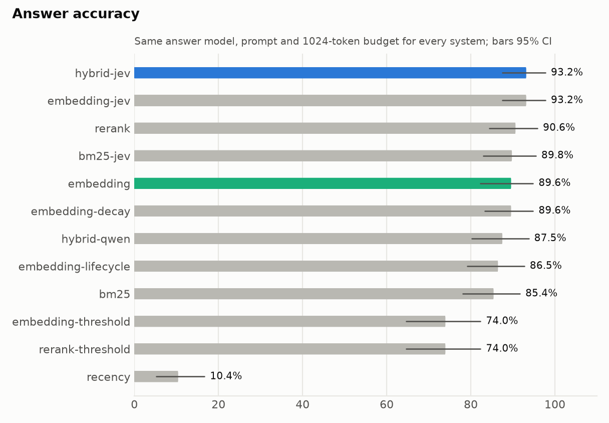
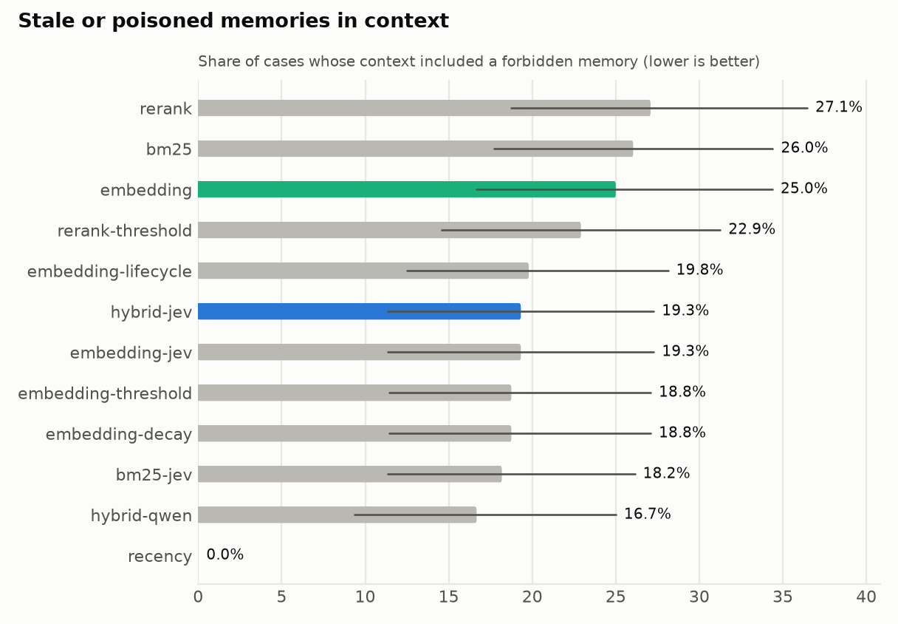
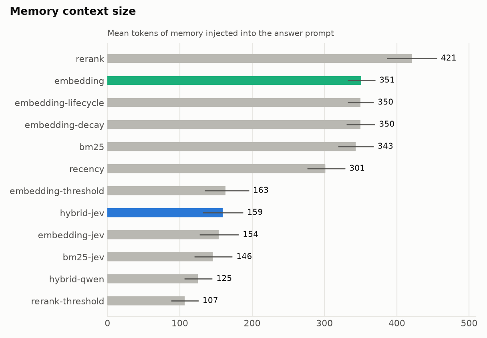
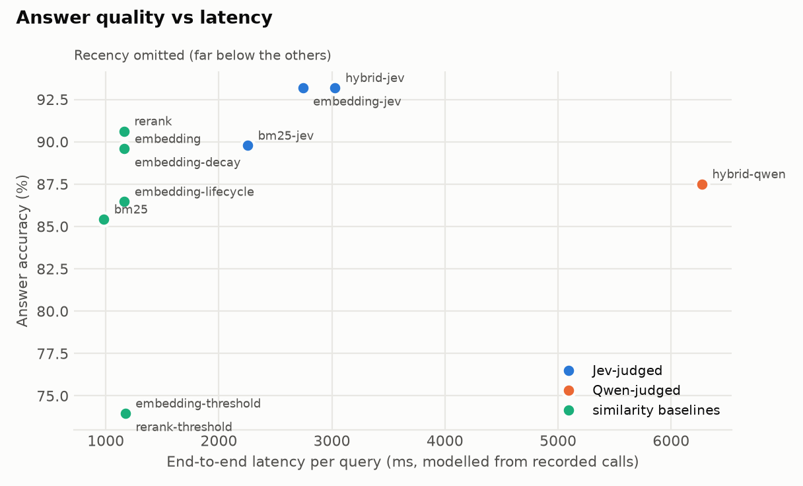
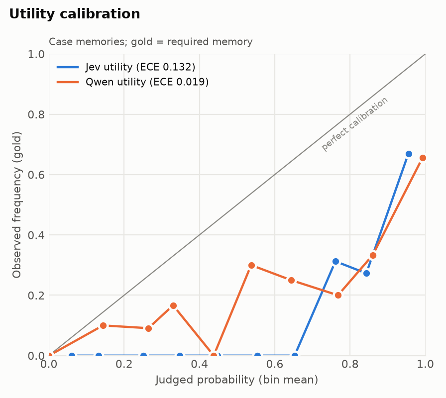

# Benchmark report: `lme-partial-96`

- Cases: 96 (cases-preregistered-first96.jsonl); background distractors per case: 0; context budget: 1024 tokens
- Git commit: `a893badcd3bee5c6eae693dff6204c0bee2cb072` (dirty); question schema `q1.2`; policy `p1.2`; answer prompt `a1.1`
- Models observed: {'jev': ['typesafe/jev-1.13-20260917'], 'qwen': ['qwen3.8-27b']}; embedding `Qwen/Qwen3-Embedding-0.6B`; reranker `BAAI/bge-reranker-v2-m3`
- Judge failures (cases): {'jev': 8, 'qwen': 0}

Intervals are 95% family-level bootstrap CIs. Latency is modelled from recorded per-call latencies (Qwen calls were recorded under benchmark concurrency, shared with answer generation).

## Primary comparison (pre-registered)

Answer accuracy, hybrid-jev minus embedding: **+2.3 pp** [95% CI -3.4, +8.0] over 88 families (paired family bootstrap, 5,000 resamples) -> **no detectable difference** (95% CI contains 0).

## All systems

| System | Answer acc. | Selection acc. | Forbidden in ctx | Neutral in ctx | Ctx tokens | Judge ms | E2E ms | Failed |
|---|---|---|---|---|---|---|---|---|
| hybrid-jev | 93.2 [87.5, 97.7] | 80.7 [72.7, 88.6] | 19.3 [11.4, 27.3] | 1 [0, 1] | 159 [132, 187] | 1847 [1628, 2199] | 3029 [2701, 3490] | 8 |
| embedding-jev | 93.2 [87.5, 97.7] | 80.7 [72.7, 88.6] | 19.3 [11.4, 27.3] | 1 [0, 1] | 154 [128, 181] | 1560 [1360, 1894] | 2743 [2426, 3205] | 8 |
| bm25-jev | 89.8 [83.0, 95.5] | 79.5 [71.6, 87.5] | 18.2 [11.4, 26.1] | 1 [0, 1] | 146 [121, 172] | 1275 [1183, 1372] | 2255 [2163, 2353] | 8 |
| hybrid-qwen | 87.5 [80.2, 93.8] | 78.1 [69.8, 86.5] | 16.7 [9.4, 25.0] | 0 [0, 1] | 125 [107, 145] | 5090 [4177, 6055] | 6273 [5356, 7242] | 0 |
| embedding | 89.6 [82.3, 94.8] | 72.9 [63.5, 81.2] | 25.0 [16.7, 34.4] | 4 [4, 4] | 351 [333, 370] | 0 | 1165 [1005, 1471] | 0 |
| embedding-threshold | 74.0 [64.6, 82.3] | 59.4 [49.0, 68.8] | 18.8 [11.5, 27.1] | 1 [1, 2] | 163 [135, 195] | 0 | 1172 [1014, 1477] | 0 |
| embedding-lifecycle | 86.5 [79.2, 92.7] | 75.0 [65.6, 83.3] | 19.8 [12.5, 28.1] | 4 [4, 4] | 350 [333, 368] | 0 | 1165 [1004, 1471] | 0 |
| embedding-decay | 89.6 [83.3, 94.8] | 79.2 [70.8, 86.5] | 18.8 [11.5, 27.1] | 4 [4, 4] | 350 [331, 369] | 0 | 1164 [1005, 1471] | 0 |
| rerank | 90.6 [84.4, 95.8] | 72.9 [63.5, 81.2] | 27.1 [18.8, 36.5] | 4 [4, 4] | 421 [387, 455] | 0 | 1162 [1002, 1469] | 0 |
| rerank-threshold | 74.0 [64.6, 82.3] | 57.3 [47.9, 66.7] | 22.9 [14.6, 31.2] | 0 [0, 0] | 107 [89, 125] | 0 | 1173 [1013, 1478] | 0 |
| bm25 | 85.4 [78.1, 91.7] | 68.8 [59.4, 78.1] | 26.0 [17.7, 34.4] | 4 [4, 4] | 343 [319, 367] | 0 | 983 [959, 1018] | 0 |
| recency | 10.4 [5.2, 16.7] | 10.4 [5.2, 16.7] | 0.0 | 5 [5, 5] | 301 [277, 328] | 0 | 1021 [1002, 1042] | 0 |

## Answer accuracy by category

| Category | hybrid-jev | embedding-jev | bm25-jev | hybrid-qwen | embedding | embedding-threshold | embedding-lifecycle | embedding-decay | rerank | rerank-threshold | bm25 | recency |
|---|---|---|---|---|---|---|---|---|---|---|---|---|
| knowledge-update | 89 [72, 100] | 89 [72, 100] | 89 [72, 100] | 85 [69, 96] | 85 [69, 96] | 73 [56, 88] | 77 [58, 92] | 85 [69, 96] | 88 [73, 100] | 81 [65, 96] | 88 [73, 100] | 8 [0, 19] |
| single-session-user | 94 [88, 98] | 94 [88, 98] | 89 [81, 95] | 88 [80, 95] | 94 [88, 98] | 73 [62, 83] | 92 [84, 98] | 94 [88, 98] | 95 [90, 100] | 69 [58, 80] | 88 [80, 95] | 3 [0, 8] |
| single-session-user_abs | 100 | 100 | 100 | 100 | 67 [33, 100] | 83 [50, 100] | 67 [33, 100] | 67 [33, 100] | 50 [17, 83] | 100 | 50 [17, 83] | 100 |

## Memory-selection accuracy by category

| Category | hybrid-jev | embedding-jev | bm25-jev | hybrid-qwen | embedding | embedding-threshold | embedding-lifecycle | embedding-decay | rerank | rerank-threshold | bm25 | recency |
|---|---|---|---|---|---|---|---|---|---|---|---|---|
| knowledge-update | 6 [0, 17] | 6 [0, 17] | 11 [0, 28] | 35 [15, 54] | 8 [0, 19] | 15 [4, 27] | 23 [8, 42] | 31 [15, 50] | 0 | 8 [0, 19] | 0 | 4 [0, 12] |
| single-session-user | 100 | 100 | 97 [92, 100] | 94 [88, 98] | 97 [92, 100] | 73 [64, 83] | 94 [88, 98] | 97 [92, 100] | 100 | 73 [62, 84] | 94 [88, 98] | 5 [0, 11] |
| single-session-user_abs | 100 | 100 | 100 | 100 | 100 | 100 | 100 | 100 | 100 | 100 | 100 | 100 |

## Calibration of judge probabilities

| Probabilities | n | ECE | Brier |
|---|---|---|---|
| hybrid-jev utility (all candidates) | 2854 | 0.132 | 0.045 |
| hybrid-jev utility (case memories) | 2854 | 0.132 | 0.045 |
| hybrid-qwen utility (all candidates) | 3187 | 0.019 | 0.017 |
| hybrid-qwen utility (case memories) | 3187 | 0.019 | 0.017 |

## Failure cases: hybrid-jev vs embedding

| Bucket | Cases |
|---|---|
| hybrid-jev right, embedding wrong | 4 |
| embedding right, hybrid-jev wrong | 2 |
| both wrong | 4 |
| both right | 78 |

#### hybrid-jev right, embedding wrong

**lme/5d3d2817** (single-session-user). Query: "What was my previous occupation?". Expected: llm_judge []
- hybrid-jev: selected ['s026t04:required', 's026t08:neutral', 's018t02:neutral'] (+0 background) -> "Marketing specialist at a small startup"
- embedding: selected ['s035t00:neutral', 's026t08:neutral', 's044t02:neutral', 's035t06:neutral', 's038t04:neutral'] (+0 background) -> "Managing a team of interns at a startup"

**lme/15745da0_abs** (single-session-user_abs). Query: "How long have I been collecting vintage films?". Expected: llm_judge []
- hybrid-jev: selected [] (+0 background) -> "I don't have any information about your vintage film collection." [abstain]
- embedding: selected ['s036t04:neutral', 's036t00:neutral', 's036t02:neutral', 's036t08:neutral', 's022t00:neutral'] (+0 background) -> "Three months"

**lme/bc8a6e93_abs** (single-session-user_abs). Query: "What did I bake for my uncle's birthday party?". Expected: llm_judge []
- hybrid-jev: selected [] (+0 background) -> "I don't have any memories about what you baked for your uncle's birthday party." [abstain]
- embedding: selected ['s015t02:neutral', 's015t00:neutral', 's039t02:neutral', 's039t06:neutral', 's032t06:neutral'] (+0 background) -> "Lemon blueberry cake"

#### embedding right, hybrid-jev wrong

**lme/51a45a95** (single-session-user). Query: "Where did I redeem a $5 coupon on coffee creamer?". Expected: llm_judge []
- hybrid-jev: selected ['s042t04:required'] (+0 background) -> "Last Sunday"
- embedding: selected ['s042t04:required', 's042t00:neutral', 's042t06:neutral', 's042t02:neutral', 's030t06:neutral'] (+0 background) -> "Target"

**lme/f9e8c073** (knowledge-update). Query: "How many sessions of the bereavement support group did I attend?". Expected: llm_judge []
- hybrid-jev: selected ['s019t04:forbidden', 's039t06:required'] (+0 background) -> "The memories conflict: one says three sessions, the other says five sessions." [conflict]
- embedding: selected ['s019t04:forbidden', 's019t02:neutral', 's039t08:neutral', 's039t10:neutral', 's039t06:required'] (+0 background) -> "Five sessions" [conflict]

#### both wrong

**lme/58ef2f1c** (single-session-user). Query: "When did I volunteer at the local animal shelter's fundraising dinner?". Expected: llm_judge []
- hybrid-jev: selected ['s049t02:neutral', 's049t08:required'] (+0 background) -> "February 2023"
- embedding: selected ['s049t02:neutral', 's031t10:neutral', 's043t00:neutral', 's049t08:required', 's043t02:neutral'] (+0 background) -> "February"

**lme/3b6f954b** (single-session-user). Query: "Where did I attend for my study abroad program?". Expected: llm_judge []
- hybrid-jev: selected ['s021t08:required'] (+0 background) -> "University of Melbourne"
- embedding: selected ['s021t08:required', 's030t10:neutral', 's046t06:neutral', 's040t00:neutral', 's041t04:neutral'] (+0 background) -> "University of Melbourne"

**lme/66f24dbb** (single-session-user). Query: "What did I buy for my sister's birthday gift?". Expected: llm_judge []
- hybrid-jev: selected ['s019t04:required', 's019t06:neutral'] (+0 background) -> "A yellow dress and a pair of silver hoop earrings with a small pearl in the center"
- embedding: selected ['s019t04:required', 's019t02:neutral', 's019t08:neutral', 's025t08:neutral', 's025t00:neutral'] (+0 background) -> "A yellow dress and a pair of matching earrings"

## Charts

